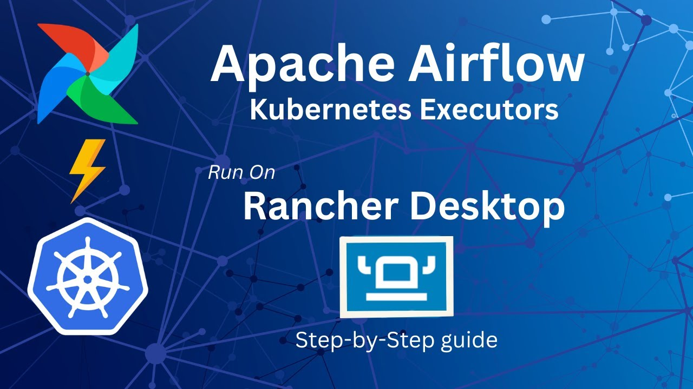

# Airflow-k8s-rancher
Run airflow on local Kubernetes cluster managed by Rancher Desktop

Watch YouTube tutorial here: https://youtube.com/watch?v=eZBD-G3Ybhs

## Prerequisites 
Prior knowledge on Airflow as well as Kubernetes is a must. 

Airflow tutorials: https://www.youtube.com/playlist?list=PLzKRcZrsJN_xcKKyKn18K7sWu5TTtdywh

Articles: 
1. https://maxcotec.com/apache-airflow-architecture
2. https://maxcotec.com/blog/apache-airflow-2-docker-beginners-guide/

## Requirements 

[rancher-desktop](https://rancherdesktop.io/): 

nerdctl: docker-alike cli tool packed with more than what docker can do. Comes with rancher-desktop. 

[kubectl](https://kubernetes.io/docs/tasks/tools): A command line tool for communicating with a Kubernetes cluster.

[k9s](https://k9scli.io/topics/install): A terminal based UI to interact with your Kubernetes clusters.

[helm](https://helm.sh/): The package manager for Kubernetes

###  Tools version used in this tutorial: 
Rancher-desktop: v1.9.1

nerdctl:  1.4.0

k9s: 0.25.18

kubectl: Client Version: version.Info{Major:"1", Minor:"23", GitVersion:"v1.23.4", GitCommit:"e6c093d87ea4cbb530a7b2ae91e54c0842d8308a", GitTreeState:"clean", BuildDate:"2022-02-16T12:30:48Z", GoVersion:"go1.17.6", Compiler:"gc", Platform:"darwin/arm64"}

helm: {Version:"v3.12.1", GitCommit:"f32a527a060157990e2aa86bf45010dfb3cc8b8d", GitTreeState:"clean", GoVersion:"go1.20.4"}

## Run Instructions:

1. Install [rancher-desktop](https://rancherdesktop.io/), and enable kubernetes cluster. Be sure to select `containerd` as Container Engine.

2. Build the image (from airflow-dags/ directory): `nerdctl --namespace k8s.io build . -t airflow-rke:latest`
3. deploy airflow via helm chart: (from helm-chart/ directory):  
`helm upgrade --install airflow . --values values.yaml --set airflow.dags_image.repository=airflow-rke --set airflow.dags_image.tag=latest --set airflow.dags_image.pull_policy=Never`

### Common issues:
1. Container won't start stating error `airflow-rke:latest Image not found`.

   * make sure you keep the image in `k8s.io` namespace and 
   * image pull_policy is set to `Never`. This flag ensures that kubectl does not pull the image from the remote registry. 
By default, Kubernetes will try to pull images from a remote registry if unavailable locally. In this case, you’re forcing the local image.

2. Airflow scheduler and webserver won't start due to following error; `Permission denied: '/opt/airflow/logs/scheduler`

    This is caused mostly by missconfiguration on your PV nad PVC.  Rancher-dektop kubernets comes with a service called
    [local-path-provisioner](https://github.com/rancher/local-path-provisioner) which is deployed in kube-system namespace. 
    this tool provides a way for the Kubernetes users to utilize the local storage on each node. Make sure its running ok and 
    both of your pods (scheduler and webserver) are bind with the pvc `airflow-logs`.

## KubernetesPodSensor

This repository is used to build and demonstrate a special type of custom sensor `KubernetsPodSensor`. Code is available
under `/airflow-dags/dags/k8s_pod_sensor.py` and the DAG using this sensor is `/airflow-dags/dags/k8sPodSensorDag.py`.
We demonstrated this sensor by using [dynamoDB table reader code](https://github.com/maxcotec/dynamodb-readiness-check).
